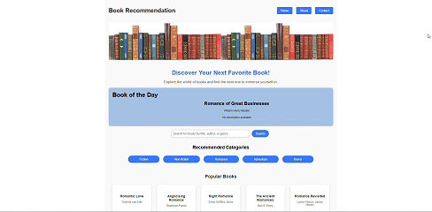

# **Book Recommendation Engine**

This project allows users to explore books, find recommendations, and interact with book details. The application consists of two parts:
- **Frontend**: Built with React and deployed on GitHub Pages.
- **Backend**: Built with Node.js and Express, deployed on Render.

---

<p align="center">
  
</p>

---

---

## **Features**

1. **Book of the Day**: Displays a random book to kickstart your exploration.
2. **Search Functionality**: Search for books by title, author, or genre.
3. **Recommended Categories**: Provides predefined genres to explore books.
4. **Feedback System**: Users can "like" or "dislike" books to give feedback.
5. **Popular Books**: Highlights trending books.
6. **Book Details**: View detailed information about each book.

--

## **Folder Structure**

### **Main Directory**
```
book_recommendation/
├── frontend/   # React-based user interface
├── backend/    # Node.js server and API logic
```

### **Frontend Folder**
```
frontend/
├── public/
│   ├── index.html    # Entry point for React app
│   └── manifest.json # Metadata for PWA
├── src/
│   ├── components/   # Contains React components
│   │   ├── BookList.js
│   │   ├── BookOfTheDay.js
│   │   └── FeedbackForm.js
│   ├── App.js        # Main application logic
│   ├── index.js      # Entry point for React rendering
│   └── App.css       # Styles for the app
└── package.json       # Dependencies and scripts for the React app
```

### **Backend Folder**
```
backend/
├── routes/
│   ├── bookRoutes.js      # Handles book-related routes
│   └── feedbackRoutes.js  # Handles user feedback routes
├── server.js              # Main server file
├── .env                   # Environment variables
├── package.json           # Dependencies and scripts for Node.js server
└── README.md              # Backend-specific documentation
```

---

## **API Endpoints**

### **Backend**
- **GET /api/books**: Fetches books from the Google Books API based on user queries.
  - **Parameters**: `query` (e.g., `?query=fiction`)
- **POST /api/feedback**: Receives user feedback for a book.
  - **Body**:
    ```json
    {
      "bookId": "book-id-here",
      "feedback": "thumbs_up"
    }
    ```

---

## **Deployment**

### **Frontend**
1. Build the project:
   ```bash
   npm run build
   ```
2. Deploy to GitHub Pages:
   ```bash
   npm run deploy
   ```

### **Backend**
1. Deploy to Render:
   - Set `Root Directory` to `backend/`.
   - Use `npm install` as the Build Command.
   - Use `npm run start` as the Start Command.

---

## **Links**

- **Live Frontend**: [Frontend Deployment URL](https://nafisatibrahim.github.io/book_recommendation_frontend/)
- **Backend API**: [Backend Deployment URL](https://book-recommendation.onrender.com/)
- - **Backend Codes**: [Backend Codes](https://nafisatibrahim.github.io/book_recommendation)

---

## **Usage Instructions**

1. Open the frontend link.
2. Use the search bar to find books.
3. Explore categories or view the "Book of the Day."
4. Provide feedback (like/dislike) on books.

---

## **Technologies Used**

- **Frontend**: React, React Router, Axios
- **Backend**: Node.js, Express, Axios
- **APIs**: Google Books API
- **Hosting**: GitHub Pages (Frontend), Render (Backend)

---

## **Contributing**

Feel free to fork this repository and make contributions. If you have any feature requests or issues, please open a GitHub issue or submit a pull request.

---

## **License**

This project is licensed under the MIT License.

---

## **Contact**

- **Author**: Nafisat Ibrahim  
- **Email**: nafisat.l@outlook.com
- **GitHub**: [Nafisatibrahim](https://github.com/Nafisatibrahim)
